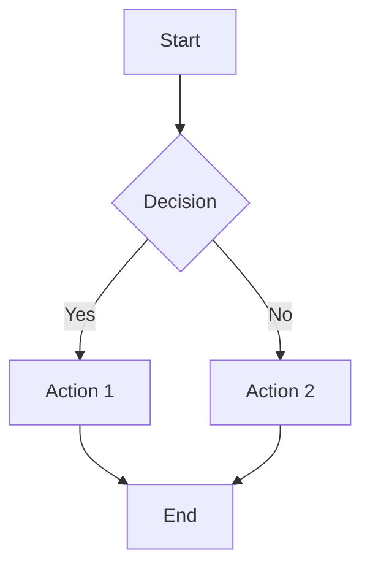
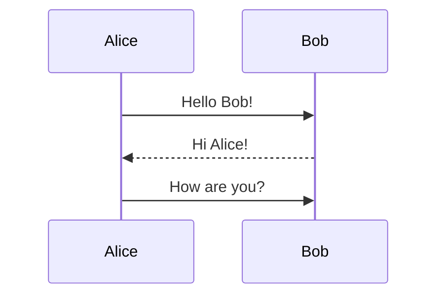
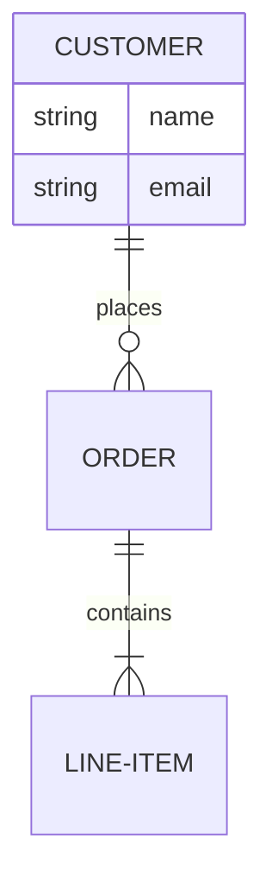

# Mermaid MCP Server

Generate beautiful diagrams from Mermaid syntax code via Model Context Protocol (MCP).

## Features

- **3 MCP Tools**: Generate diagrams, validate syntax, list diagram types
- **Multiple Formats**: PNG, SVG (default), PDF
- **Configurable Quality**: Scale (1-3) and width (800-3200px) settings
- **8+ Diagram Types**: Flowcharts, sequence, class, ER, state, gantt, pie, gitGraph
- **HTTP Image Serving**: Returns URLs to view diagrams in browser/chat
- **Authentication**: Optional Bearer token auth for security
- **Docker Deployment**: Fully containerized with mermaid-cli

## Quick Start

### 1. Clone & Configure

```bash
git clone https://github.com/aviciot/mcp_mermaid
cd mcp_mermaid

# Copy environment template
cp .env.example .env

# Edit .env (optional - auth disabled by default)
# AUTH_ENABLED=true
# AUTH_TOKEN=your_secret_token
# PUBLIC_BASE_URL=http://localhost:8401
```

### 2. Start Server

```bash
docker-compose up -d
```

Server runs on `http://localhost:8401`

### 3. Configure Claude Desktop

Add to `claude_desktop_config.json`:

```json
{
  "mcpServers": {
    "mermaid": {
      "url": "http://localhost:8401/sse",
      "transport": {
        "type": "sse"
      }
    }
  }
}
```

Restart Claude Desktop.

## Usage

### Generate Diagram

```
User: Create a flowchart showing user authentication flow

Claude: [Calls generate_mermaid_diagram with mermaid_code]
```

**Tool Parameters:**
- `mermaid_code` (required): Mermaid diagram syntax
- `output_format`: svg (default), png, pdf
- `theme`: default, dark, forest, neutral
- `background`: white, transparent
- `scale`: 1 (fast), 2 (balanced), 3 (high quality)
- `width`: 800-3200 pixels

**Response:**
```json
{
  "success": true,
  "image_url": "http://localhost:8401/diagrams/diagram_abc123_1234567890.svg?token=your_token",
  "file_name": "diagram_abc123_1234567890.svg",
  "format": "svg",
  "size_bytes": 15420
}
```

### Validate Syntax

```
User: Check if this Mermaid code is valid: graph TD; A-->B

Claude: [Calls validate_mermaid_syntax]
```

Returns: `{valid: true, diagram_type: "flowchart", node_count: 1}`

### List Diagram Types

```
User: What diagram types are supported?

Claude: [Calls list_diagram_types]
```

Returns supported types with examples.

## Diagram Examples

### Flowchart


### Sequence Diagram


### ER Diagram


See full examples: [Mermaid Documentation](https://mermaid.js.org/)

## Configuration

Edit `server/config/settings.yaml`:

```yaml
mermaid:
  default_format: "svg"        # Default output format
  default_theme: "default"     # Default theme
  default_background: "white"  # Background color
  max_retry_attempts: 5        # Max syntax error retries
  cleanup_after_hours: 24      # Auto-delete old diagrams (0=never)
  max_diagram_size: 50000      # Max characters in code
```

## Quality Settings

| Profile | Scale | Width | Time | Size | Use Case |
|---------|-------|-------|------|------|----------|
| **Fast** | 1 | 800px | ~5-10s | ~10KB | Quick previews |
| **Balanced** | 2 | 1600px | ~10-15s | ~30KB | General use (default) |
| **High** | 3 | 2400px | ~20-30s | ~90KB | Presentations |

**Note**: SVG ignores scale/width (vector format). Fastest option.

## Format Comparison

| Format | Size | Quality | Browser | Slack | MCPJam |
|--------|------|---------|---------|-------|--------|
| **SVG** | Smallest | Scalable | ✅ | ⚠️ Converts to PNG | ✅ Best |
| **PNG** | Medium | Fixed | ✅ | ✅ Best | ✅ |
| **PDF** | Largest | Fixed | ✅ | ❌ | ❌ |

**Recommendation**: Use SVG for web/MCPJam, PNG for Slack.

## Authentication

### Enable Authentication

In `.env`:
```bash
AUTH_ENABLED=true
AUTH_TOKEN=your_secret_token_here
```

### MCP Tool Calls

Claude automatically includes Bearer token (configured in `claude_desktop_config.json`).

### Direct API Calls

```bash
curl -X POST http://localhost:8401/mcp \
  -H "Authorization: Bearer your_token" \
  -H "Content-Type: application/json" \
  -d '{
    "jsonrpc": "2.0",
    "method": "tools/call",
    "params": {
      "name": "generate_mermaid_diagram",
      "arguments": {
        "mermaid_code": "graph TD; A-->B"
      }
    },
    "id": 1
  }'
```

### View Images

Images include token in URL: `?token=your_token`

```
http://localhost:8401/diagrams/diagram_abc123.svg?token=your_token
```

## Architecture

```
mermaid-mcp/
├── docker-compose.yml          # Container orchestration
├── Dockerfile                  # Python + Node.js + mermaid-cli
├── .env                        # Configuration
├── server/
│   ├── server.py              # Starlette + MCP server
│   ├── mcp_app.py             # FastMCP instance
│   ├── config.py              # Config loader
│   ├── config/
│   │   └── settings.yaml      # Main configuration
│   └── tools/
│       └── mermaid_tools.py   # 3 MCP tools
└── data/
    └── diagrams/              # Generated images (Docker volume)
```

## Ports

- **8401** (host) → **8400** (container)
- Change in `docker-compose.yml` if needed

## Troubleshooting

### Check Logs
```bash
docker logs mermaid_mcp
```

### Common Issues

**"Connection refused"**
- Check container is running: `docker ps | grep mermaid_mcp`
- Verify port 8401 is not in use

**"Authentication failed"**
- Check `.env` AUTH_TOKEN matches Claude Desktop config
- Ensure AUTH_ENABLED=true if using authentication

**"Syntax error in diagram"**
- Use `validate_mermaid_syntax` tool first
- Check [Mermaid Live Editor](https://mermaid.live) for syntax

**"Generation timeout"**
- Reduce quality: scale=1, width=800
- Use SVG format (fastest)
- Simplify complex diagrams

### Restart Server
```bash
docker-compose restart
```

### Rebuild After Changes
```bash
docker-compose down
docker-compose build
docker-compose up -d
```

## Development

### Local Testing (without Docker)

```bash
cd server
pip install -r requirements.txt

# Install Node.js and mermaid-cli
npm install -g @mermaid-js/mermaid-cli

# Run server
python server.py
```

### Add Custom Tool

1. Create `server/tools/my_tool.py`
2. Import mcp instance: `from mcp_app import mcp`
3. Define tool with `@mcp.tool()` decorator
4. Restart container

## Environment Variables

| Variable | Default | Description |
|----------|---------|-------------|
| `MCP_PORT` | 8400 | Server port (inside container) |
| `AUTH_ENABLED` | false | Enable Bearer token authentication |
| `AUTH_TOKEN` | - | Secret token for auth |
| `PUBLIC_BASE_URL` | http://localhost:8401 | Public URL for image links |
| `MERMAID_OUTPUT_DIR` | /app/data/diagrams | Diagram storage path |
| `MERMAID_MAX_RETRIES` | 5 | Max syntax error retries |

## License

MIT

## Links

- **Mermaid Documentation**: https://mermaid.js.org/
- **MCP Specification**: https://modelcontextprotocol.io/
- **FastMCP Framework**: https://github.com/jlowin/fastmcp

## Support

Issues: https://github.com/aviciot/mcp_mermaid/issues

---

Built with ❤️ using FastMCP and Mermaid
